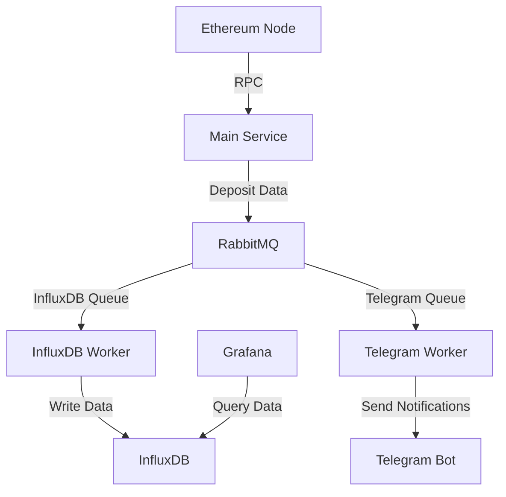

# Ethereum Deposit Tracker

## Overview

The Ethereum Deposit Tracker is a robust and efficient system designed to monitor and record ETH deposits on the Beacon Deposit Contract. This project uses RabbitMQ for message queuing, InfluxDB for data storage, and Grafana for visualization. It also includes optional Telegram notifications for real-time alerts.

## Architecture



## Features

- Real-time monitoring of ETH deposits to the Beacon Deposit Contract
- Efficient message queuing with RabbitMQ
- Data storage in InfluxDB for time-series analysis
- Grafana dashboard for data visualization
- Optional Telegram notifications for real-time alerts
- Comprehensive error handling and logging
- Dockerized setup for easy deployment

## Prerequisites

- Node.js (v14 or later)
- Docker and Docker Compose
- Alchemy API key
- Telegram Bot Token (optional)
- InfluxDB credentials
- Grafana credentials


# Ethereum Deposit Tracker Setup and Installation

This guide will walk you through setting up and running the Ethereum Deposit Tracker project. Please follow the steps carefully to ensure everything is properly configured.

## 1. Clone the Repository

```bash
git clone "https://github.com/Swaraj4507/eth-deposit-tracker"
```

## 2. Run Docker Compose for Grafana and InfluxDB

**Note:** You may need to update the `.env` configuration files for Grafana and InfluxDB. Ensure these settings are also updated in the backend `.env` file. Follow the existing configuration format for consistency.

Navigate to the `grafana_influxdb` folder in your project directory and run the following command:

```
docker-compose up -d

```

You should now be able to see:

- **Grafana UI** at [http://localhost:3000/](http://localhost:3000/)
  - Login with the credentials:
    - Username: `admin`
    - Password: *password from Grafana.env file*

- **InfluxDB UI** at [http://localhost:8086/](http://localhost:8086/)
  - Fill in the credentials by looking at the `influxdb.env` file located in the `grafana_influxdb/` folder.

**Skip this step if you can access both services.**

### If you are unable to access these services:

1. Check whether the containers are running using the following command:

```bash
docker ps
```

2. If you see nothing, create the network `influxdb_nk` with the following command:

```bash
docker network create influxdb_nt
```

3. Inspect the network:

```bash
docker network inspect influxdb_nt
```

This command will output JSON data that includes details about the network, including the containers connected to it. Look for the `Containers` section in the output.

### You can also use Docker Desktop to check container status.

**Note:** Make sure virtualization is enabled on your machine to run Docker Engine.

## 3. Run Docker Compose for RabbitMQ
Navigate to the `rabbitmq` folder in your project directory and run the following command:

```
docker-compose up -d

```
You should be able to see RabbitMQ UI at [http://localhost:15672/](http://localhost:15672/)

- Login with the credentials:
  - Username: `guest`
  - Password: `guest`

## 4. Backend Setup

Navigate to the `/backend` folder and follow these steps:

### Install dependencies:

```bash
npm install
```

### Set up environment variables

Create a `.env` file in the root directory and add the following:
 ```
   ALCHEMY_API_KEY=your_alchemy_api_key
   BEACON_CONTRACT_ADDRESS=0x00000000219ab540356cBB839Cbe05303d7705Fa
   RABBITMQ_URL=amqp://localhost
   INFLUXDB_URL=http://localhost:8086
   INFLUXDB_TOKEN=your_influxdb_token
   INFLUXDB_ORG=your_org
   INFLUXDB_BUCKET=your_bucket
   TELEGRAM_BOT_TOKEN=your_telegram_bot_token
   TELEGRAM_CHAT_ID=your_telegram_chat_id
   ```

- **Alchemy API key** from the Alchemy site.
- **InfluxDB Token** can be found at [http://localhost:8086/](http://localhost:8086/):
  - Navigate to **Data -> Token** and copy the Admin user token.
- **Telegram API key** from Telegram BotFather.

### To get the Telegram chat ID

1. Go to `telegram_worker.js`.
2. Uncomment the following code and run it inside the `/backend` folder:

```


 const bot = new TelegramBot(process.env.TELEGRAM_BOT_TOKEN, { polling: true });

 // When any message is received, log the chatId
 bot.on('message', (msg) => {
   const chatId = msg.chat.id;
  
  // Send a confirmation message with the chatId
   bot.sendMessage(chatId, `Your chat ID is: ${chatId}`);
  
  console.log(`Chat ID: ${chatId}`);
  
   // Optionally, you can stop polling after getting the chatId
  bot.stopPolling();
 });

```

3. After getting the chat ID, comment the code back.
4. Update the `ChatId` in the `.env` file.

### Remaining environment variables

```bash
INFLUXDB_ORG=ethereum_org
INFLUXDB_BUCKET=ethereum_deposits
```

Your final `.env` in the `/backend` folder should look like this:

```
ALCHEMY_API_KEY=your_alchemykey
BEACON_CONTRACT_ADDRESS=0x00000000219ab540356cBB839Cbe05303d7705Fa
INFLUXDB_URL=http://localhost:8086
INFLUXDB_TOKEN=Admin_user_token
INFLUXDB_ORG=ethereum_org
INFLUXDB_BUCKET=ethereum_deposits
TELEGRAM_BOT_TOKEN=token_from_BotFather
TELEGRAM_CHAT_ID=chat_id


```


## 5. Run the Application

Open 3 terminals in the `/backend` folder and run the following commands:

- **Terminal 1:**

```
node index.js
```

- **Terminal 2:**

```
node influxdb_worker.js
```

- **Terminal 3:**

```
node telegram_worker.js
```

## 6. Check Logs

You can also check the logs in the `logs/` folder.

## Expected Outputs

- **Terminal 1:**

```
PS D:\eth-deposit-tracker\backend> node index.js
{"level":"info","message":"Server is running on port 3030","timestamp":"2024-09-10T12:57:18.692Z"}
{"level":"info","message":"Connected to RabbitMQ","timestamp":"2024-09-10T12:57:18.798Z"}
{"level":"info","message":"Latest block number: 20720358","timestamp":"2024-09-10T12:57:25.495Z"}
{"level":"info","message":"New block detected: 20720358","timestamp":"2024-09-10T12:57:25.498Z"}
{"level":"info","message":"New block detected: 20720359","timestamp":"2024-09-10T12:57:39.307Z"}
```

- **Terminal 2:**

```
 D:\eth-deposit-tracker\backend> node influxdb_worker.js
{"level":"info","message":"InfluxDB worker is waiting for messages","timestamp":"2024-09-10T12:56:44.169Z"}
```

- **Terminal 3:**

```
PS D:\eth-deposit-tracker\backend> node telegram_worker.js
{"level":"info","message":"Telegram worker is waiting for messages","timestamp":"2024-09-10T12:56:13.637Z"}
```

---
## Setting up InfluxDB Data Source in Grafana

Follow these steps to set up the InfluxDB data source in Grafana.
Go through this if required[https://youtu.be/Jszd7zrl-_U?si=WQhMbHZXDj5OaBgA]

### 1. Access Grafana UI
- Open your browser and go to [http://localhost:3000](http://localhost:3000).
- Log in with the following credentials:
  - **Username:** `admin`
  - **Password:** (from the `Grafana.env` file)

### 2. Add a New Data Source
- On the Grafana home page, click the **gear icon (⚙️)** on the left sidebar to open **Configuration**.
- Select **Data Sources** from the menu.

### 3. Choose the Data Source Type
- Click the **Add data source** button.
- Scroll down and choose **InfluxDB** from the list of available data sources.

### 4. Configure InfluxDB Data Source
- In the **HTTP** section, enter the following details:
  - **URL:** `http://influxdb:8086` or `http://influxdb:8086`.
- In the **Auth** section, leave as default unless your InfluxDB requires additional authentication.
- In the **InfluxDB Details** section, fill in:
  - **Database:** Your InfluxDB database name (e.g., `ethereum_deposits`).
  - **User:**  The username for your InfluxDB.
  - **Password:** The password for your InfluxDB.

### 5. Set Up Access Token (if needed)
- If using tokens, provide an **InfluxDB Token**:
  - Navigate to [http://localhost:8086](http://localhost:8086).
  - Go to **Data -> Tokens** and copy the token for the Admin user.
  - Paste this token into the **Auth Token** field in Grafana.

### 6. Save and Test
- Click **Save & Test**.
- Grafana will attempt to connect to InfluxDB. If successful, you'll see a confirmation message.

Now your InfluxDB data source is set up in Grafana!

### Screenshots
*(Insert screenshots here)*


## Usage

Once the system is up and running, it will automatically start tracking ETH deposits to the Beacon Deposit Contract. You can monitor the logs for each component to ensure everything is working correctly.

To view the Grafana dashboard:
1. Open a web browser and go to `http://localhost:3000`
2. Log in with your Grafana credentials
3. Navigate to the Ethereum Deposit Tracker dashboard
4. Create dashboards and check desired data insights
   

## Configuration

You can modify the following files to adjust the configuration:

- `index.js`: Main service configuration
- `influxdb_worker.js`: InfluxDB worker configuration
- `telegram_worker.js`: Telegram worker configuration
- `docker-compose.yml`: Docker services configuration

## Troubleshooting

If you encounter any issues:

1. Check the logs for each component (main service, workers, and Docker containers)
2. Ensure all environment variables are correctly set
3. Verify that all required services (RabbitMQ, InfluxDB, Grafana) are running

## Docker Setup for whole app (optional)
Run this in root directory 

```
docker-compose up -d
```
Check application logs:

```
docker-compose logs app
```

Verify RabbitMQ:

Open a web browser and go to http://localhost:15672
Log in with the credentials (default: guest/guest)
Check if the queues influxdb_queue and telegram_queue exist

# Check logs for a specific service
```
docker-compose logs influxdb_worker
docker-compose logs telegram_worker
```


