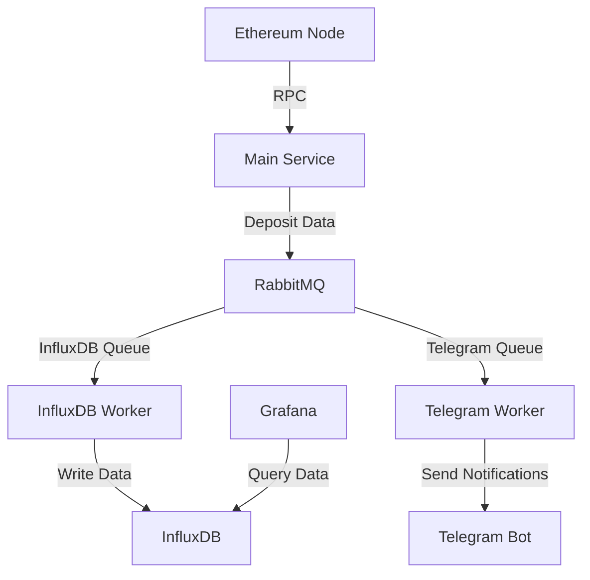

# Ethereum Deposit Tracker

## Overview

The Ethereum Deposit Tracker is a robust and efficient system designed to monitor and record ETH deposits on the Beacon Deposit Contract. This project uses RabbitMQ for message queuing, InfluxDB for data storage, and Grafana for visualization. It also includes optional Telegram notifications for real-time alerts.

## Architecture



## Features

- Real-time monitoring of ETH deposits to the Beacon Deposit Contract
- Efficient message queuing with RabbitMQ
- Data storage in InfluxDB for time-series analysis
- Grafana dashboard for data visualization
- Optional Telegram notifications for real-time alerts
- Comprehensive error handling and logging
- Dockerized setup for easy deployment

## Prerequisites

- Node.js (v14 or later)
- Docker and Docker Compose
- Alchemy API key
- Telegram Bot Token (optional)
- InfluxDB credentials
- Grafana credentials


# Ethereum Deposit Tracker Setup and Installation

This guide will walk you through setting up and running the Ethereum Deposit Tracker project. Please follow the steps carefully to ensure everything is properly configured.

## 1. Clone the Repository

```bash
git clone <repository-url>
```

## 2. Run Docker Compose for Grafana and InfluxDB

**Note:** You may need to update the `.env` configuration files for Grafana and InfluxDB. Ensure these settings are also updated in the backend `.env` file. Follow the existing configuration format for consistency.

Navigate to the `grafana_influxdb` folder in your project directory and run the following command:

```bash
# Command to run Docker Compose
```

You should now be able to see:

- **Grafana UI** at [http://localhost:3000/](http://localhost:3000/)
  - Login with the credentials:
    - Username: `admin`
    - Password: *password from Grafana.env file*

- **InfluxDB UI** at [http://localhost:8086/](http://localhost:8086/)
  - Fill in the credentials by looking at the `influxdb.env` file located in the `grafana_influxdb/` folder.

**Skip this step if you can access both services.**

### If you are unable to access these services:

1. Check whether the containers are running using the following command:

```bash
# Command to check running containers
```

2. If you see nothing, create the network `influxdb_nk` with the following command:

```bash
# Command to create the network
```

3. Inspect the network:

```bash
# Command to inspect the network
```

This command will output JSON data that includes details about the network, including the containers connected to it. Look for the `Containers` section in the output.

### You can also use Docker Desktop to check container status.

**Note:** Make sure virtualization is enabled on your machine to run Docker Engine.

## 3. Run Docker Compose for RabbitMQ

You should be able to see RabbitMQ UI at [http://localhost:15672/](http://localhost:15672/)

- Login with the credentials:
  - Username: `guest`
  - Password: `guest`

## 4. Backend Setup

Navigate to the `/backend` folder and follow these steps:

### Install dependencies:

```bash
# Command to install dependencies
```

### Set up environment variables

Create a `.env` file in the root directory and add the following:

- **Alchemy API key** from the Alchemy site.
- **InfluxDB Token** can be found at [http://localhost:8086/](http://localhost:8086/):
  - Navigate to **Data -> Token** and copy the Admin user token.
- **Telegram API key** from Telegram BotFather.

### To get the Telegram chat ID

1. Go to `telegram_worker.js`.
2. Uncomment the following code and run it inside the `/backend` folder:

```bash
# Command to get chat ID
```

3. After getting the chat ID, comment the code back.
4. Update the `ChatId` in the `.env` file.

### Remaining environment variables

```bash
INFLUXDB_ORG=ethereum_org
INFLUXDB_BUCKET=ethereum_deposits
```

Your final `.env` in the `/backend` folder should look like this:

```bash
# Example .env file
```

## 5. Run the Application

Open 3 terminals in the `/backend` folder and run the following commands:

- **Terminal 1:**

```bash
# Command for Terminal 1
```

- **Terminal 2:**

```bash
# Command for Terminal 2
```

- **Terminal 3:**

```bash
# Command for Terminal 3
```

## 6. Check Logs

You can also check the logs in the `logs/` folder.

## Expected Outputs

- **Terminal 1:**

```bash
# Example output for Terminal 1
```

- **Terminal 2:**

```bash
# Example output for Terminal 2
```

- **Terminal 3:**

```bash
# Example output for Terminal 3
```

---

### Screenshots
*(Insert screenshots here)*


## Usage

Once the system is up and running, it will automatically start tracking ETH deposits to the Beacon Deposit Contract. You can monitor the logs for each component to ensure everything is working correctly.

To view the Grafana dashboard:
1. Open a web browser and go to `http://localhost:3000`
2. Log in with your Grafana credentials
3. Navigate to the Ethereum Deposit Tracker dashboard

## Configuration

You can modify the following files to adjust the configuration:

- `index.js`: Main service configuration
- `influxdb_worker.js`: InfluxDB worker configuration
- `telegram_worker.js`: Telegram worker configuration
- `docker-compose.yml`: Docker services configuration

## Troubleshooting

If you encounter any issues:

1. Check the logs for each component (main service, workers, and Docker containers)
2. Ensure all environment variables are correctly set
3. Verify that all required services (RabbitMQ, InfluxDB, Grafana) are running


