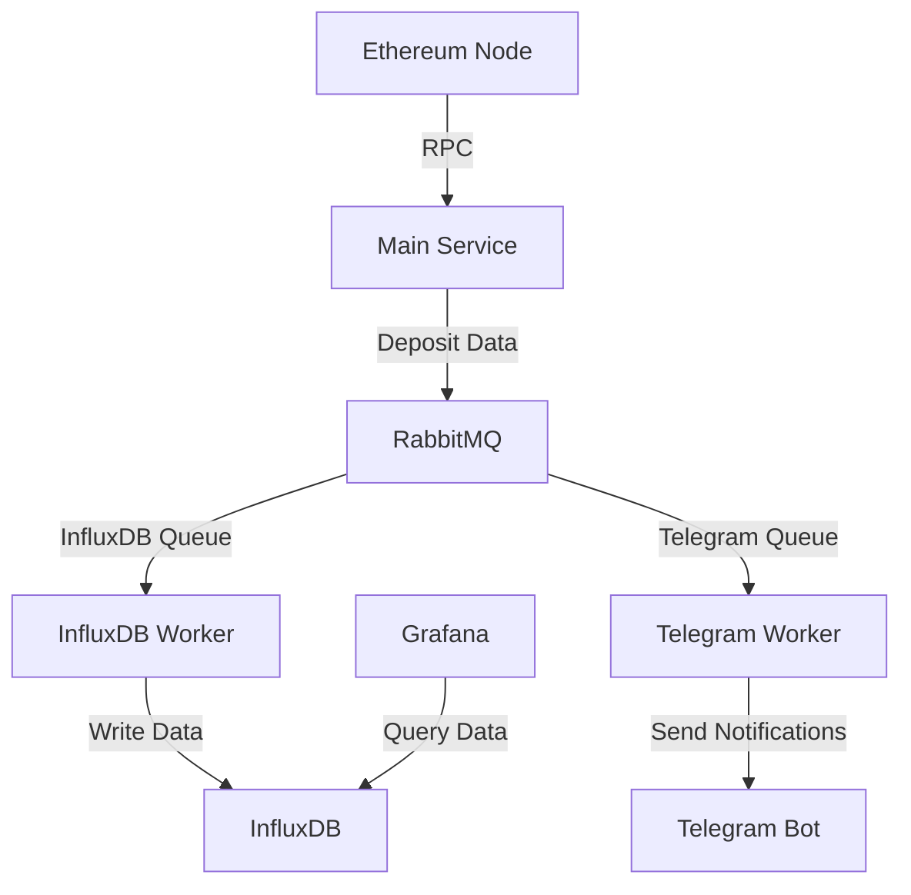

# Ethereum Deposit Tracker

## Overview

The Ethereum Deposit Tracker is a robust and efficient system designed to monitor and record ETH deposits on the Beacon Deposit Contract. This project uses RabbitMQ for message queuing, InfluxDB for data storage, and Grafana for visualization. It also includes optional Telegram notifications for real-time alerts.

## Architecture



## Features

- Real-time monitoring of ETH deposits to the Beacon Deposit Contract
- Efficient message queuing with RabbitMQ
- Data storage in InfluxDB for time-series analysis
- Grafana dashboard for data visualization
- Optional Telegram notifications for real-time alerts
- Comprehensive error handling and logging
- Dockerized setup for easy deployment

## Prerequisites

- Node.js (v14 or later)
- Docker and Docker Compose
- Alchemy API key
- Telegram Bot Token (optional)
- InfluxDB credentials
- Grafana credentials

## Installation

1. Clone the repository:
   ```
   git clone https://github.com/your-username/ethereum-deposit-tracker.git
   cd ethereum-deposit-tracker
   ```

2. Install dependencies:
   ```
   npm install
   ```

3. Set up environment variables:
   Create a `.env` file in the root directory and add the following:
   ```
   ALCHEMY_API_KEY=your_alchemy_api_key
   BEACON_CONTRACT_ADDRESS=0x00000000219ab540356cBB839Cbe05303d7705Fa
   RABBITMQ_URL=amqp://localhost
   INFLUXDB_URL=http://localhost:8086
   INFLUXDB_TOKEN=your_influxdb_token
   INFLUXDB_ORG=your_org
   INFLUXDB_BUCKET=your_bucket
   TELEGRAM_BOT_TOKEN=your_telegram_bot_token
   TELEGRAM_CHAT_ID=your_telegram_chat_id
   ```

4. Start the Docker containers:
   ```
   docker-compose up -d
   ```

5. Run the main service:
   ```
   node index.js
   ```

6. Run the workers:
   ```
   node influxdb_worker.js
   node telegram_worker.js
   ```

## Usage

Once the system is up and running, it will automatically start tracking ETH deposits to the Beacon Deposit Contract. You can monitor the logs for each component to ensure everything is working correctly.

To view the Grafana dashboard:
1. Open a web browser and go to `http://localhost:3000`
2. Log in with your Grafana credentials
3. Navigate to the Ethereum Deposit Tracker dashboard

## Configuration

You can modify the following files to adjust the configuration:

- `index.js`: Main service configuration
- `influxdb_worker.js`: InfluxDB worker configuration
- `telegram_worker.js`: Telegram worker configuration
- `docker-compose.yml`: Docker services configuration

## Troubleshooting

If you encounter any issues:

1. Check the logs for each component (main service, workers, and Docker containers)
2. Ensure all environment variables are correctly set
3. Verify that all required services (RabbitMQ, InfluxDB, Grafana) are running


